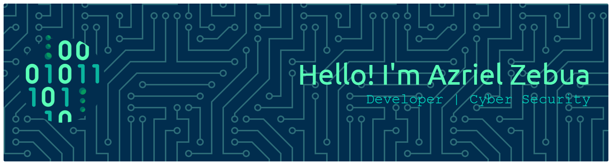

# Hello!!! I'm Azriel

<!-- Here are some ideas to get you started:

- 🔭 I’m currently working on President University Robotic & Technology Club

- 🌱 I’m currently learning Spring Boot, Next.JS, TypeScript, Laravel

#### Skills

#### Let's Connected

#### Stats

 -->

### 💫 About Me:

##### Hello!!! I'm Azriel  - 🔭 I’m currently working on President University Robotic & Technology Club  - 🌱 I’m currently learning Spring Boot, Next.JS, TypeScript, Laravel  - Fun Fact : I'm a Computer Science student with high curiousity, easy to reach. I'm specifically learning Cyber Security. I'm familiar with Linux and Windows Operating System

##### 🌐 Socials:

  

##### 💻 Tech Stack:

                  

##### 📊 GitHub Stats:

 
 

##### ✍️ Random Dev Quote

---

<!-- Proudly created with GPRM ( https://gprm.itsvg.in ) -->
